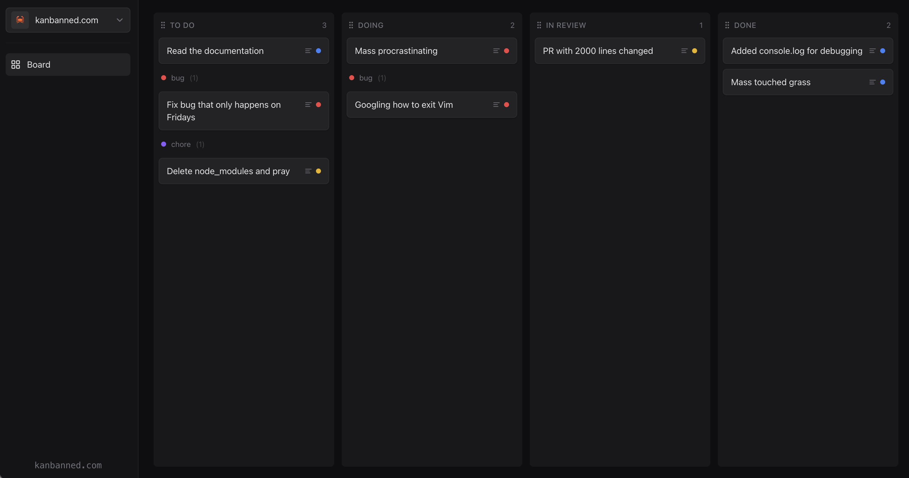

# Kanbanned

A free, offline-first Kanban board that works entirely in your browser. No sign-up required.



## Features

- **Swim lanes** — Cards of a category stay grouped together within columns
- **Multi-board support** — Create and switch between multiple boards
- **Drag and drop** — Reorder cards, move between columns, rearrange columns
- **Priorities** — Mark cards as low, medium, or high priority
- **Works offline** — Full PWA support with service worker caching
- **No account needed** — Data stored locally in your browser

## Projects

- **Kanbanned** — Free, offline-first Kanban board that works entirely in your browser.

## Getting Started

```bash
# Install dependencies
npm install

# Run development server
npm run dev

# Build for production
npm run build

# Serve production build
npm start
```

Open [http://localhost:3000](http://localhost:3000) to use the app.

## Tech Stack

- [Next.js 15](https://nextjs.org/) + [React 19](https://react.dev/)
- [TypeScript](https://www.typescriptlang.org/)
- [Tailwind CSS](https://tailwindcss.com/)
- [dnd-kit](https://dndkit.com/) for drag and drop
- [Radix UI](https://www.radix-ui.com/) for accessible components

## Data Storage

All data is stored in your browser's localStorage. Your boards, cards, and settings never leave your device.

## License

[MIT](LICENSE)
